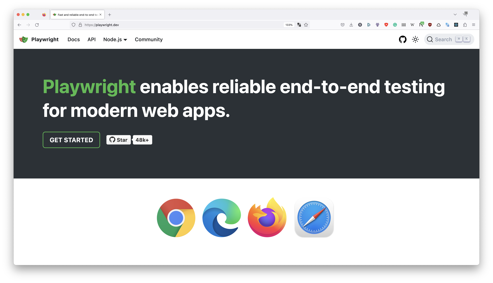

# Playwright Test Workshop
> 🔥 The new cool kid in testing town.

`playwright` started as an automation library similar to `puppeteer` but quickly evolved to a full test runner and framework with `@playwright/test`.
## The goal

This workshop teaches you Playwright Test (PWT) essentials to get started in the world of end-to-end testing.

Supportive materials and tasks are all included in the `/lessons` directory. The lessons are built on top of each other and are hands-on — **work through them at your own pace**. I'll answer questions on the way and might do the exercises, too.

To follow along, all the examples will test [an online demo webshop called "Danube"](https://danube-web.shop/).

But feel free to test and implement functionality on other websites. **Start testing your local development or production sites!**

> **Note** You can also find running examples and solutions for each lesson under `/solutions`.
## Action plan

Work through the materials at your own pace. I'll cover lessons every now and then live and will answer questions on the way. Have fun!

## Agenda

- `30min` — Playwright Intro presentation
- `30min` — Playwright tooling
- `90min` — Playwright's essential concepts
- `The rest` — Write tests for your project!

-------

[Let's get started](./lessons/01-tooling/01-getting-started.md)!
