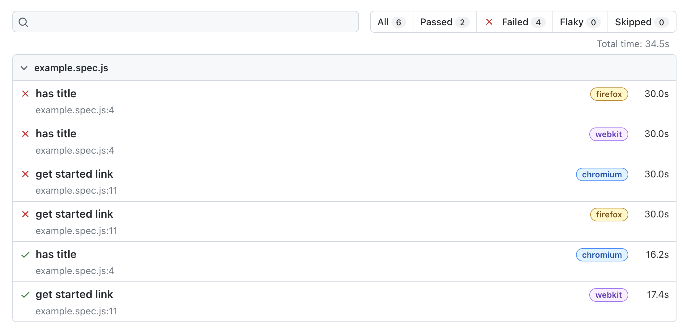

# Get started with `@playwright/test` (`PWT`)
> Get up and running with a new Playwright Test project.

Playwright started as an automation library used for web scraping and browser automation similar to Puppeteer. But it quickly evolved to a full test runner and framework that's built to scale.


## Install Playwright Test

The best way to get started is the default `init` command.

```bash
$ npm init playwright@latest

Getting started with writing end-to-end tests with Playwright:
Initializing project in '.'
✔ Do you want to use TypeScript or JavaScript? · JavaScript
✔ Where to put your end-to-end tests? · tests
✔ Add a GitHub Actions workflow? (y/N) · true
✔ Install Playwright browsers (can be done manually via 'npx playwright install')? (Y/n) · true
Initializing NPM project (npm init -y)…
Installing Playwright Test…
...
```
> **Warning** Unless you're very (!) fluent in TypeScript **please choose JavaScript** in the setup guide. If you're using a modern editor you'll still be able to use Intellisense.

Confirm that the installation succeeded by running your first PWT test.

```
$ npx playwright test

Running 6 tests using 5 workers
  6 passed (3.6s)

To open last HTML report run:

  npx playwright show-report
```

Congratulations! You've just run your first headless PWT tests!

Familiarize yourself with the generated HTML report.

```
$ npx playwright show-report
```



Use the `--headed` flag to see your new end-to-end automation in action.

```
$ npx playwright test --headed
```

> **Note**
> By default Playwright test runs in full fledged parallel mode and kicks off multiple parallel processes to run your tests. This functionality can be tweaked via the `workers` and `fullyParallel` in the `playwright.config.js`, on a test-level or via the command line. Find more information [in the docs](https://playwright.dev/docs/test-parallel) or [in this YouTube video](https://www.youtube.com/watch?v=fG0YePSS5iA&list=PLMZDRUOi3a8NtMq3PUS5iJc2pee38rurc&index=11).

## `playwright.config.js` — all these options! 🤯

Inspect the provided `playwright.config.js` to familiarize yourself with all the possibilities. The config file is very well documented, so it's worth to poke around.

During the workshop we'll look at:

- tooling
- timeouts
- traces
- devices
- fixtures
- auto-waiting
- and much more.

-----

## 🏗️ Action time with the good old Danube shop (or your own site)

- [ ] Install and run the example tests against `playwright.dev` with `npx playwright test`

-----

Let's get started and give you [a headstart by recording your first test](./02-recording-tests.md)!
