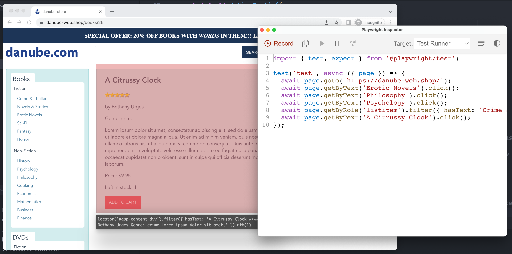
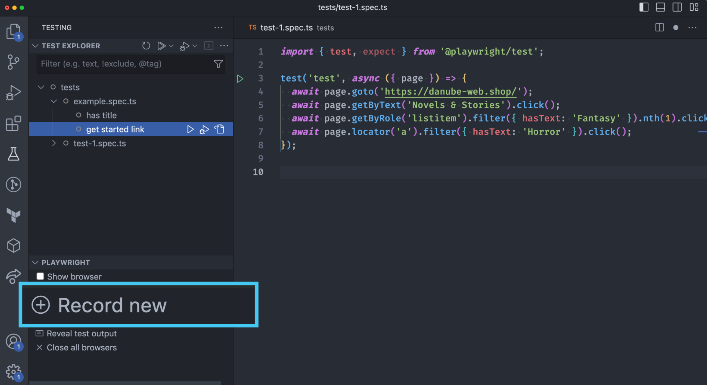

# Record your first PWT test
> Get a headstart with `codegen`.

Playwright provides invaluable "test recording" functionality called `codegen`.
## Record tests via the `playwright` command

Kick off a new `codegen` session with `npx playwright codegen`.

```bash
$ npx playwright codegen https://danube-web.shop/
$ npx playwright codegen https://your-site.de/
```

Click around in the opened browser and see how your PWT script develops in the Playwright inspector automatically.



Copy and paste into your new test file (`./tests/example.spec.js`).

> **Warning** Watch out to not change your `import` / `require` statements when copying over.
## Record tests via the Playwright VS Code extension

Most of Playwright's CLI functionality is also available via [the official VS Code extension](https://marketplace.visualstudio.com/items?itemName=ms-playwright.playwright).

Suppose you're a VS Code user and you want to give it a spin, run and record your tests from within VS Code.



## Result

After you recorded and created a new test, make sure it works by running it.

```bash
$ npx playwright test
$ npx playwright test --headed
```

> **Note** At this stage Playwright will run three browsers to run your tests. To change this behavior and only run Chromium edit `projects` in your `playwright.config.js`.

After a recorded session, you should have the first test available and it should look similar to the following:

```javascript
// tests/example.spec.js
const { test, expect } = require('@playwright/test');

test('test', async ({ page }) => {
  await page.goto('https://danube-web.shop/');
  await page.locator('a').filter({ hasText: 'Crime & Thrillers' }).click();
  await page.locator('a').filter({ hasText: 'Sci-Fi' }).click();
  await page.locator('a').filter({ hasText: 'Fantasy' }).click();
});
```

> **Note**
> `codegen` can only record Playwright Test actions. It's an invaluable tool to get started but to make your tests valuable you have to add assertions manually. **Playwright can't know what you want to test.** We'll come to assertions at a later stage.

-----

## 🏗️ Action time with the good old Danube shop (or your own site)

**Task**

- [ ] Record a new test case and log into [Danube](https://danube-web.shop/) (Email: `user@email.com`, Password: `supersecure1`)

-----

But how do you debug tests in a headless world? [Let's look at debugging and tracing](./03-debugging-and-traces.md).
