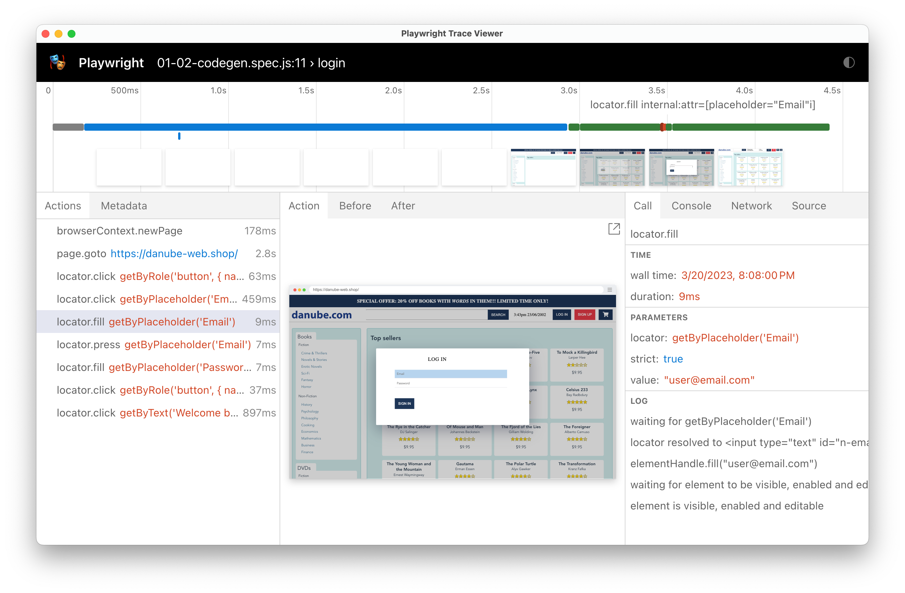

# Debug your Playwright tests
> Debugging with super powers.

To understand what your tests are doing, it's essential to be familiar with Playwright's debugging tools.

## Debug locally during development

Leverage the command line or [the official VS Code extension](https://marketplace.visualstudio.com/items?itemName=ms-playwright.playwright) to debug with ease.

### Debugging via the command line


Spin up the Playwright debugger with the `--debug` flag.

```
$ npx playwright test --debug
$ npx playwright test tests/example.spec.js --debug
```

Check all available test options via `npx playwright test --help`.

> **Note**
> To only run a single test in one file from the command line, [leverage `test.only`](https://playwright.dev/docs/api/class-test#test-only).

### Debugging in VS Code


[Run particular tests from within VS Code](https://marketplace.visualstudio.com/items?itemName=ms-playwright.playwright). In some areas, the VS Code extension is more powerful than the terminal because it allows you to inspect variables, set break points and run a single test by clicking a button.

> **Note** If you're running and debugging tests, ensure that you have ticked `Show browser` to see what's happening.


## Debug remote tests running in CI/CD with traces

The debugger is a great way to develop your tests, but what about test runs that failed in a remote environment, in CI/CD or on your co-workers machine? Playwright Test provides debugging traces for this case!



A trace file is a snapshot recording of every action your test performed. It includes console messages, network information, HTML snapshots and much more!

In default configuration Playwright is not collecting traces during local development, but to learn what they're about, change your `playwright.config.js` to always collect a trace for every test.

```javascript
// playwright.config.js
module.exports = defineConfig({
  use: {
    trace: 'on',
  },
	// ...
});
```

Run your tests.

```
$ npx playwright test
```

`trace: on` will now generate new trace `zip` files for every single test available at `test-results/`.

> **Note**
> Trace file generation slows Playwright down. It's recommend to only generate trace files in remote environments and for possibly failed and retried tests (`on-first-retry`).

But that's a `zip` file. What should you do with it?

### Inspect traces via the command line

```
$ npx playwright show-trace test-results/example-has-title-webkit/trace.zip
```

The trace viewer visualizes all test steps, a timeline and an HTML snapshot of the page. **It's time travel debugging for your end-to-end tests**.
### Inspect traces via the online trace viewer

But trace files aren't only accessible via the command line. If you have a trace `zip`, you can also always inspect it at [trace.playwright.dev](https://trace.playwright.dev/).

------

## 🏗️ Action time with the good old Danube shop (or your own site)

**Task**

- [ ] Start a debug session to inspect what your login test is doing so far
- [ ] Generate and inspect traces for your generated test run

-----

These are the most important things to know about the provided Playwright Test tooling. [Let's have a look at important Playwright Test concepts](../02-writing-tests/01-locators-and-actionability.md).
