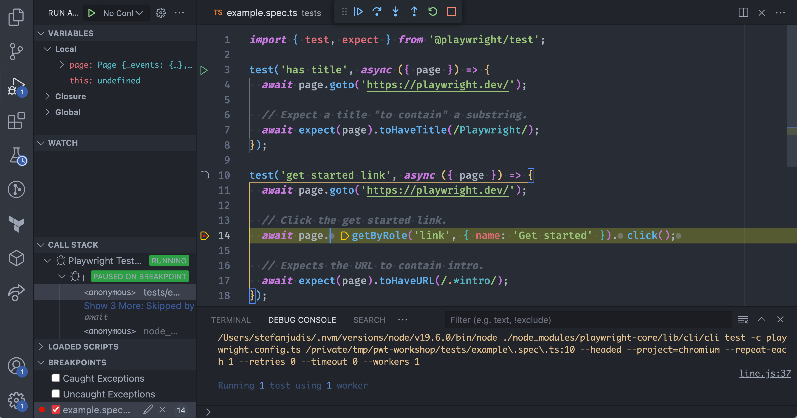

# Debug your Playwright tests


## Debug locally and during development

To debug and develop your tests solid debugging tools are essential. Leverage the command line or the VS Code extension to debug with ease.
### Debugging via the command line


Spin up the Playwright debugger with the `--debug` flag.

```
$ npx playwright test --debug
$ npx playwright test tests/example.spec.js --debug
```

> **Note**
> Check all available test options via `npx playwright test --help`.

Tip: to only run a single test from the command line, [leverage `test.only`](https://playwright.dev/docs/api/class-test#test-only).
### Debugging in VS Code



Run particular tests from within VS Code. It's more powerful than the terminal because it allows you to inspect variables and scope.
## Debug remote tests running in CI/CD


VS code + tooling
