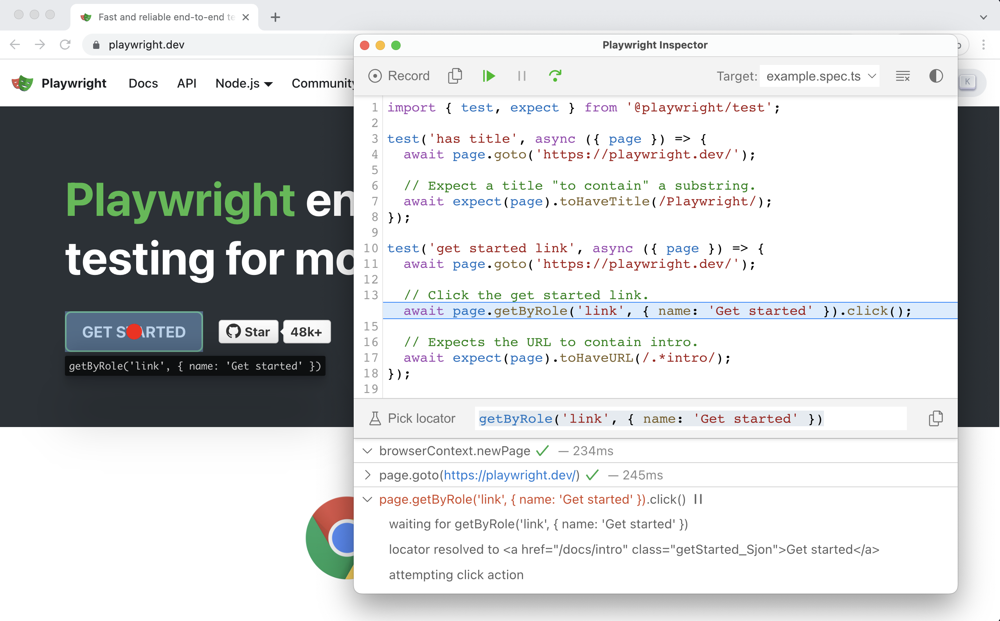

# Debug your Playwright tests


## Debug locally and during development

To debug and develop your tests solid debugging tools are essential. Leverage the command line or the VS Code extension to debug with ease.
### Debugging via the command line



Spin up the Playwright debugger with the `--debug` flag.

```
$ npx playwright test --debug
$ npx playwright test tests/example.spec.js --debug
```

Check all available test options via `npx playwright test --help`.

> **Note**
> To only run a single test from the command line, [leverage `test.only`](https://playwright.dev/docs/api/class-test#test-only).

TODO pros / cons of each approach
### Debugging in VS Code


Run particular tests from within VS Code. It's more powerful than the terminal because it allows you to inspect variables and scope.
## Debug remote tests running in CI/CD with traces

But what about test runs that failed in a remote environment? PWT provides debug traces for this case.


Change your `playwright.config.[ts|js]` to always collect traces.

```javascript
// playwright.config.ts
export default defineConfig({
  use: {
    /* Collect trace when retrying the failed test. See https://playwright.dev/docs/trace-viewer */
    trace: 'on',
  },
	// ...
});
```

This will generate trace files for every single test. A trace file is a detailed recording of every step your test case performed — all debug information is available in a single `trace.zip` file under `test-results`.

> **Note**
> Trace file generation slows Playwright down. It's recommend to only generate trace files on possibly failed and retried tests (`on-first-retry`).

### Inspect traces via the command line

```
$ npx playwright show-trace test-results/example-has-title-webkit/trace.zip
```
### Inspect traces via the online trace viewer

But trace files aren't only accessible via the command line. If you have a trace `zip`, you can also always inspect it at [trace.playwright.dev/](https://trace.playwright.dev/).

------

These are the most important things to know about the provided Playwright Test tooling. [Let's have a look at important PWT concepts](../../02-writing-tests/01-locators-and-actionability/README.md).
