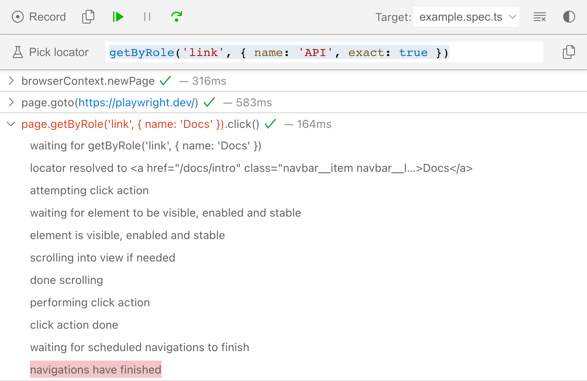
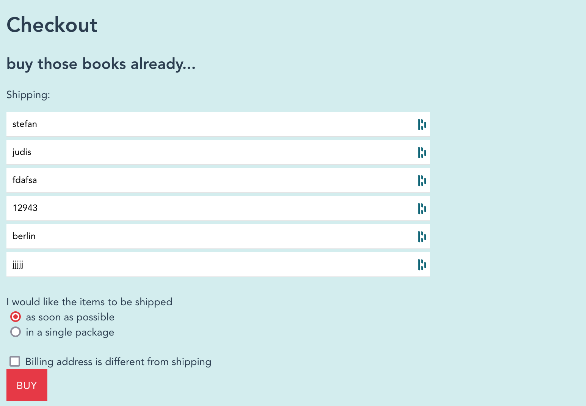

# Start interacting with websites
> To the power of user-first DOM selection.

So far, you've only recorded tests. Now it's time to understand how Playwright Test handles interactions.

[Playwright's selection engine is based on locators](https://playwright.dev/docs/locators) that are available on [the `page` fixture](https://playwright.dev/docs/api/class-page).

> **Note** Don't worry about fixtures. We'll talk about them later.

## Locators

The Playwright team highly encourages the usage of "user-first" locators to be as close to the end-user experience as possible. The recommended locators are:

- `page.getByRole()` (user-first)
- `page.getByText()` (user-first)
- `page.getByLabel()` (user-first)
- `page.getByPlaceholder()` (user-first)
- `page.getByAltText()` (user-first)
- `page.getByTitle()` (user-first)
- `page.getByTestId()` ("qa-first")

> **Note**
> If you follow the user-first approach, using `codegen` to create and tweak locators leads to results the quickest.

If these user-first locators don't fit your need, CSS selector based locators work (`page.locator('.cta')`), too.

[Check other locators](https://playwright.dev/docs/other-locators).

### Important locator characteristics

Playwright Test's locators include core functionality you must be aware of.

#### Locators are strict

A locator throws an exception if it matches multiple DOM elements.

```javascript
await page.getByRole('link').click();
// Error:
// locator.click: Error: strict mode violation: getByRole('link') resolved to 31 elements:
// ...
```

> **Note**
> [Find more info in strictness in the docs](https://playwright.dev/docs/locators#strictness) or [this YouTube video](https://www.youtube.com/watch?v=SMFuzmxxy8o&list=PLMZDRUOi3a8NtMq3PUS5iJc2pee38rurc).

> **Warning**
> Playwright started with interaction methods on the `page` object such as `page.click(selector)`. These are discouraged and deprecated by now.
#### Locators are lazy

Every time a locator is used for an action, an up-to-date DOM element is located on the page.

```javascript
// the `locator` is only evaluated when it's used
const locator = page.getByRole('button', { name: 'Sign in' })

// evaluate DOM elements matching the locator
await locator.hover();
// evaluate DOM elements matching the locator
await locator.click();
```

> **Warning**
> Many people `await` locators. That's unnecessary because they're only holding a locator definition until they're used with an action or assertion.

#### Locators can be chained

To narrow down your selection you can always filter and chain locators.

```javascript
// The `button` locator reuses the `product` locator
const product = page.getByRole('listitem').filter({ hasText: 'Product 2' });
const button = product.getByRole('button', { name: 'Add to cart' });

// Mix of a class locator and a user-first locator
const detailContainer = page.locator(".detail-content");
const productHeading = detailContainer.getByRole("heading", { level: 2 });
```

------

## Actionability

[Playwright provides action methods for all common user interactions](https://playwright.dev/docs/input).

- `locator.fill()`
- `locator.check()`
- `locator.selectOption()`
- `locator.click()`
- `locator.dblclick()`
- `locator.hover()`
- `locator.type()`
- `locator.press()`
- ...

> **Note**
> To find the best action, `codegen` is an invaluable tool here, too!

The most important concept when it comes to PWT is that actions [auto-wait](https://playwright.dev/docs/actionability). A **`click` isn't only a `click`**. Actions in Playwright tests are asynchronous operations — why?

`await locator.click()` waits until the element is [actionable](https://playwright.dev/docs/actionability):

- the matching element is attached to the DOM
- the matching element is visible
- the matching element is stable (not animating)
- the matching element is able to receive events (not obscured by other elements)
- the matching element is enabled (no `disabled` attribute)

Additionally, when an action was performed **it'll wait until a possible navigation is completed**.

```javascript
// Concept 1:
// Click will for the element to be actionable
// Click will also auto-wait for a triggered navigation to complete
await page.getByText('Login').click();

// Concept 2:
// Fill will auto-wait for element to be actionable
await page.getByLabel('User Name').fill('John Doe');
```

> **Note**
> Debug all the taken actionability steps with the "Actionability Log" included in the debugger that shows up when running `npx playwright test --debug`.



> **Note**
> These auto-waiting concepts allow you to drop many manual `waitFor` statements because you don't have to check if an element exists or is visible. Actions will wait / retry until an element is "ready for action" or throw a timeout error in your test.

```javascript
// 👎
// Checking if an element is visible before interacting with it
await expect(page.getByText('Login')).toBeVisible();
await page.getByText('Login').click();

// 👍
// Just interact with it and let Playwright figure out the rest
await page.getByText('Login').click();
```

## 🏗️ Action time with the good old Danube shop (or your own site)

**Task**

- [ ] Record and test the add to cart functionality on `https://danube-web.shop`

> **Warning** Unfortunately, there's a bug in the checkout and all fields need to be filled out. 🤦‍♂️


