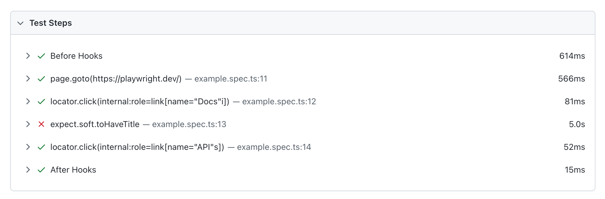
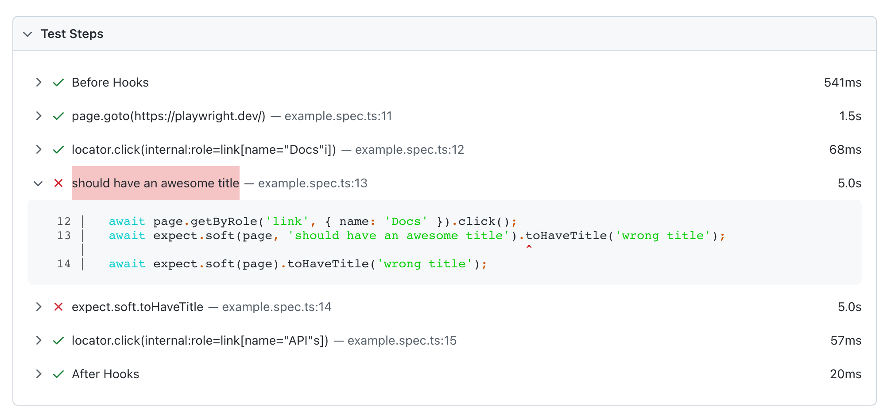

# Check that your site works correctly
> Avoid `waitFor`'s in your code base.

Due to auto-waiting mechanisms, a recorded test case tests many web functionality and critical user flows already. To nail down implementation details and test for data correctness, you need to add assertions.
## Generic vs async assertions (web-first assertions)

Playwright Test provides an assertion library out of the box.

```javascript
const { test, expect } = require('@playwright/test');
```

`expect` provides generic and async assertions.

[Generic matchers are synchronous](https://playwright.dev/docs/api/class-genericassertions) and are valuable for simple comparisons such as comparing two numbers.

```javascript
// a synchronous generic assertion
expect(number).toBe(2)
```

To test web functionality, though, async assertions come as a handy alternative.

Playwright's asynchronous web-first assertions are tailored to the web. **They're based on the same auto-waiting principles you already know about and wait / retry until a condition is met or the time out is reached**.

```javascript
// an asynchronous web-first assertion
// this assertion waits / retries until the located element becomes visible
await expect(page.getByText('welcome')).toBeVisible();
```

If you're testing websites, web-first assertions are more convenient to write and leverage PWT's core functionality.

```javascript
const { test, expect } = require('@playwright/test');

test('has title', async ({ page }) => {
  await page.goto('https://playwright.dev/');

  // 👎
  // test a condition at a single moment in time
  expect(await page.getByText('welcome').isVisible()).toBe(true);

  // 👍
  // wait for a condition to become truthy over time
  await expect(page.getByText('welcome')).toBeVisible();
});
```

## Assertion essentials

There are some core things to know about assertions.
### Configurable timeouts

Web-first assertions have a timeout config option if things take longer.

```javascript
await expect(page.getByText('welcome')).toBeVisible({timeout: 10_000})
```

> **Note**
> The default timeout is 5s and can be changed on a project basis in your Playwright config under `expect.timeout`.

### Soft assertions

[Soft assertions (`expect.soft`)](https://playwright.dev/docs/test-assertions#soft-assertions) are a handy way to fail your test case but still try to run the following actions.

```javascript
test('has title', async ({ page }) => {
  await page.goto('https://playwright.dev/');

  // If this assertion fails the test case will be marked as failed
  await expect.soft(page.getByTestId('status')).toHaveText('Success');

  // But all the following actions will still be executed and tested
  // ...
})
```

Soft assertion are particularly helpful when running longer tests.



### Assertions can be negated

Assertions also provide a quick way to flip around their meaning.

```javascript
await expect(locator).toBeVisible();
await expect(locator).not.toBeVisible();
```

### Custom assertion messages

To make your assertions more readable in your test reports. You can also define a custom message.

```javascript
await expect.soft(page, 'should have an awesome title').toHaveTitle('wrong title');
```



## ❗ Auto-waiting is the most important core principle in Playwright Test

With the built-in auto-waiting mechanisms you rarely have to implement manual `waitFor` statements.

```javascript
// click() waits for the element to be actionable
// click() waits for a triggered navigation to complete
await locator.click();

// wait for the assertion to become truthy or time out
await expect(anotherLocator).toBeVisible();
```

> **Note**
> Unless you want to explicitely wait for a particular URL there's little benefit in calling `page.waitForUrl` or similar methods.

Depending on the site you want to test, you might want to tweak [the timeout configuration](https://playwright.dev/docs/test-timeouts). These are Playwright's default timeouts for the mentioned auto-waiting concepts.

| Timeout            | Default    | Description                                                                                 |
|--------------------|------------|---------------------------------------------------------------------------------------------|
| Test Timeout       | 30000ms  | Config: `config.timeout` Override: `test.setTimeout(120_000)`                               |
| Expect Timeout     | 5000ms    | Config: `config.expect.timeout` Override: `expect(locator).toBeVisible({ timeout: 10000 })` |
| Action Timeout     | no timeout | Config: `config.use.actionTimeout` Override: `locator.click({ timeout: 10000 })`            |
| Navigation timeout | no timeout | Config: `config.use.navigationTimeout` Override: `page.goto('/', { timeout: 30000 })`       |

Tweak and adjust them as you need.

## Access data from the page

To test if your application works properly you need to query data from the DOM.

Let's say you add an item to a cart and want to check that the correct item is in cart, while being on the product detail page you can query the product title with [`locator.innerText()`](https://playwright.dev/docs/api/class-locator#locator-inner-text).

```javascript
const productHeading = page.getByRole("heading", { level: 2 });
const productName = await productHeading.first().innerText();
```

And assert that the product is in cart on the next page.

```javascript
const cartContainer = page.locator(".cart");
await expect(cartContainer.getByText(`1x, ${productName}`)).toBeVisible();
```

## 🏗️ Action time with the good old Danube shop (or your own site)

**Task**

- [ ] Extend your add to cart test and assert that the correct items have been added to the Danube cart.

> **Note** Unfortunately, Danube's HTML structure isn't that great (but which site's is?). So it'll be a little tricky to access the right DOM nodes.
