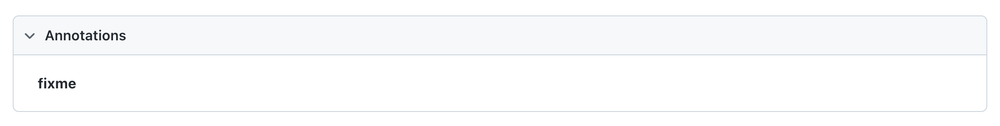
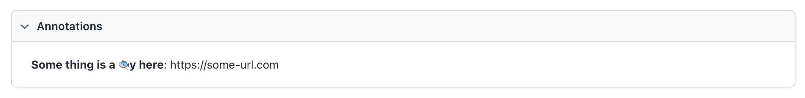

# The Playwright Test runner

So far, we've only looked at the internals of a particular test run. But how can you control when and how tests are run?

## `test` / `test.describe`

Suppose your test files grow you can always introduce a cleaner grouping using `test.describe`.

```javascript
import { test, expect } from "@playwright/test";

test.describe("playwright", () => {
  test("has title", async ({ page }) => {
    // ...
  });

  test("get started link", async ({ page, browserName }) => {
    // ...
  });
});
```

## `beforeAll`, `beforeEach`, `afterEach`, `afterAll`

Playwright provides the common test runner methods your might be familiar with.

```javascript
import { test, expect } from "@playwright/test";

test.describe("playwright", () => {
  test.beforeAll(async () => {
    console.log("Before tests");
  });

  test.beforeEach(async ({ page }) => {
    console.log("Before each");
  });

  test("has title", async ({ page }) => {
    // ...
  });

  test("get started link", async ({ page, browserName }) => {
    // ...
  });

  test.afterEach(async ({ page }) => {
    console.log("After each");
  });

  test.afterAll(async ({ page }) => {
    console.log("After tests");
  });
});

```

> **Warning** Suppose you see multiple `beforeAll` and `afterAll` logs, what's happening?
> Playwright tries to run as many tests in parallel as possible. These test runs are executed in different processes so that `beforeAll` and `afterAll` need to be ran multiple times. We'll look into parallelism later.

> **Note** Even though you might be used to `beforeEach` and `afterEach`, custom fixtures are a handy alternative to structure tests and provide similar functionality across files. More on that later....

## Individual test configuration

When Playwright runs all your tests there are multiple ways to configure single test runs.

### [`test.only`](https://playwright.dev/docs/api/class-test#test-only)

If you're focusing on a single test you can task the test runner to only run a single test.

```javascript
test.only('focus this test', async ({ page }) => {
  // Run only focused tests in the entire project.
});
```

### [`test.fixme`](https://playwright.dev/docs/api/class-test#test-fixme-2)

Don't run tests but mark them as `fixme` to look at them later.

```javascript
// skip an entire test and mark it as `fixme`
test.fixme('test to be fixed', async ({ page }) => {
  // ...
});

// skip test depending on a condition and mark it as `fixme`
test('broken in WebKit', async ({ page, browserName }) => {
  test.fixme(browserName === 'webkit', 'This feature is not implemented on Mac yet');
  // ...
});
```

### [`test.slow`](https://playwright.dev/docs/api/class-test#test-slow-1)

Mark a test as slow and tripple the auto-waiting timeouts.

```javascript
test("has title", async ({ page, browserName }) => {
  test.slow(browserName === "webkit", "This feature is slow on Mac");
  // ...
});
```

### [`test.skip`](https://playwright.dev/docs/api/class-test#test-skip-2)

Skip tests.

```javascript
test.skip('broken test', async ({ page }) => {
  // ...
});

test('skip in WebKit', async ({ page, browserName }) => {
  test.skip(browserName === 'webkit', 'This feature is not implemented for Mac');
  // ...
});
```

## Test information

Additionally to the handy `test` methods you can also access and enrich the gathered test information using [the `testInfo` fixture](https://playwright.dev/docs/api/class-testinfo#test-info-attach).

### Test attachments

Provide additional test information with [`testInfo.attach()`](https://playwright.dev/docs/api/class-testinfo#test-info-attach).

```javascript
test('basic test', async ({ page }, testInfo) => {
  await page.goto('https://playwright.dev');
  const screenshot = await page.screenshot();
  await testInfo.attach('screenshot', { body: screenshot, contentType: 'image/png' });
});
```

> **Note** Test attachments can be very handy when you tests are dealing with up and downloads.

### Custom annotations

`fixme` or `slow` tests will be annotated with their particular labels.



It's also possible to add your own annotations to the test report.

```javascript
test("is logged in", async ({ loggedInPage }, testInfo) => {
  testInfo.annotations.push({
    type: "Some thing is a 🐟y here",
    description: "https://some-url.com",
  });
  // ...
});
```

This can be valuable if you want to reference or link other materials.



## 🏗️ Action time with the good old Danube shop (or your own site)

**Tasks**

- [ ] Restructure your existing tests to use `test.describe`
- [ ] Attach a screenshot to your HTML test report using `test.info().attach()`
- [ ] Add additional grouping logic into your tests using `test.step()`
- [ ] Move the initial site navigation (`page.goto`) into a `beforeEach` hook
- [ ] Extend the `beforeEach` and log into [the Danube webshop](https://danube-web.shop/), too (Email: `user@email.com`, Password: `supersecure1`)

> **Note** If you want to share login state across test runs, [check the Playwright docs](https://playwright.dev/docs/auth).
